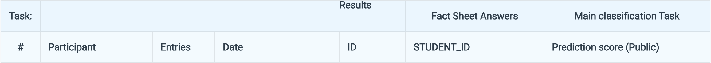
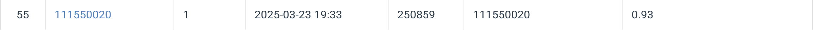

# HW1 Image classification

## Task
- Inputs  
RGB images  
Training / Validation: 21,024; Test: 2,344
- Target  
Corresponding object category id of the image  
100 categories
- Additional Requirements / Limitations  
No external data (i.e., data from other sources) allowed.  
Model size (#parameters) should less than 100M.  
Also, you can only use ResNet (e.g., ResNet18/34/…) as the model backbone in this task. Modification to the backbone is allowed.   
Not a requirement: pretrained weights is allowed.

## Prerequisites

### **Python Version**
- Python 3.9.12

### **Modules**
| Name   | Version   |
|-----------|-------|
| torch     | 2.2.1 |
| torchvision | 0.17.1 |
| optuna    | 4.2.1 |
| tqdm      | 4.64.0 |
| pandas    | 1.4.2 |

## Installation
```bash
git clone https://github.com/NnAracy/Selected-Topics-in-Visual-Recognition-using-Deep-Learning
```
```bash
cd Selected-Topics-in-Visual-Recognition-using-Deep-Learning/hw01
```
- The dataset can be downloaded from [here](https://drive.google.com/file/d/1fx4Z6xl5b6r4UFkBrn5l0oPEIagZxQ5u/view)

## Performance Snapshot

