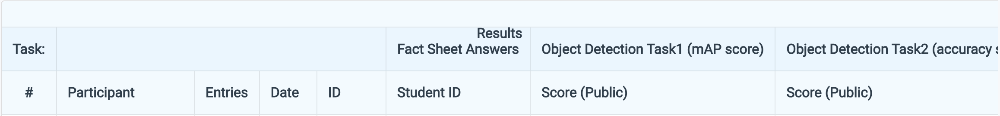
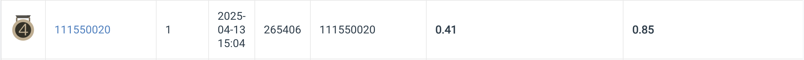

# HW2 SVHN digit recognition

## Task
- Inputs  
RGB images
Training / Validation: 30,062 / 3,340; Test: 13,068
- Target  
task1: The class and bounding box of each digit in the image, e.g., the bboxes of “4” and “9”.
task2: The number of detected digits in the image, e.g., the number “49”.
- Additional Requirements / Limitations  
    - No external data (i.e., data from other sources) allowed.  
    - You can only use Faster R-CNN as the model in this task. Faster R-CNN consists of a backbone, a neck (Region Proposal Network) and a head. Modification to each part is allowed, and elaborating your modification in the report may help you get good report score.
    - Not a requirement: pretrained weights is allowed.

## Prerequisites

### **Python Version**
- Python 3.8.20

### **Modules**
- See requirements.txt

## Installation
- This homework is implemented based on the [mmdetection](https://github.com/open-mmlab/mmdetection) library from [openmmlab](https://github.com/open-mmlab), please follow the [installation instruction](https://mmdetection.readthedocs.io/en/latest/get_started.html) of mmdetection to setup the training environment.

```bash
git clone https://github.com/NnAracy/Selected-Topics-in-Visual-Recognition-using-Deep-Learning
```
```bash
mv Selected-Topics-in-Visual-Recognition-using-Deep-Learning/hw02 mmdetection/configs/svhn

mv nycu-hw2-data mmdetection/configs/svhn

cd mmdetection/configs/svhn
```
- The dataset can be downloaded from [here](https://drive.google.com/file/d/13JXJ_hIdcloC63sS-vF3wFQLsUP1sMz5/view)

## Training
- Single gpu
```bash
python ../../tools/train.py carafe-faster-rcnn_{backbone}_bl_bfp.py --work-dir work_dirs/carafe-faster-rcnn_{backbone}
```
- Multiple gpus
```bash
../../tools/dist_train.sh carafe-faster-rcnn_{backbone}_bl_bfp.py {numebr_of_gpus} --work-dir work_dirs/carafe-faster-rcnn_{backbone}
```
- The above commands generate the last 3 checkpoints in the corresponding work directory.

## Inference
- Create a hand-crafted annotation file with blank annotations for test dataset.
```bash
python anno_generate.py
```
### Task 1
- Generates results.bbox.json(bbox prediction result in coco format) in the corresponding directory, which can be renamed as pred.json later.

- Single gpu
```bash
python ../../tools/test.py carafe-faster-rcnn_{backbone}_bl_bfp.py work_dirs/carafe-faster-rcnn_{backbone}/epoch_12.pth
```
- Multiple gpus
```bash
../../dist_test.sh carafe-faster-rcnn_{backbone}_bl_bfp.py work_dirs/carafe-fatser-rcnn_{backbone}/epoch_12.pth {number_of_gpus}
```

#### Ensemble
- Ensemble the result from the four models with different backbones to get a new results.bbox.json(in /work_dirs/ensemble_wbf by default).
```bash
python ensemble.py
```

### Task 2
- Generates pred.csv(number prediction result, in /work_dirs/ensemble_nms by default).
```bash
python solve.py
```
## Performance Snapshot

