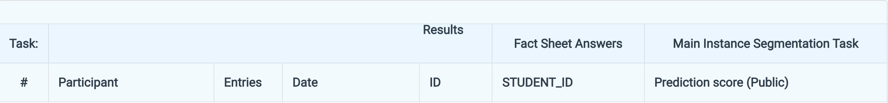
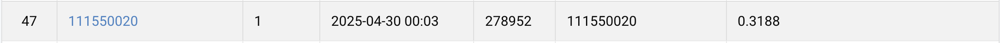

# HW3 Cell Instance Segmentation

StudentID: 111550020  
Name: 方漢霖

## Task
- Inputs  
colored medical images  
Training / Validation: 209 images  
Test: 101 images
- Target
Segmentation masks of 4 types of cells (class1, class2, class3, class4)
- Additional Requirements / Limitations  
    - No external data (i.e., data from other sources) allowed.  
    - Only pure vision-based model is allowed (No vision-language based model; No prompt-based model)
    - Base only on mask R-CNN to modify components/modules to improve the model performance.
    - Model size (trainable parameters) should less than 200M.
    - Not a requirement: pretrained weights is allowed.

## Prerequisites

### **Python Version**
- Python 3.8.20

### **Modules**
- See requirements.txt

## Installation
- This homework is implemented based on the [mmdetection](https://github.com/open-mmlab/mmdetection) library from [openmmlab](https://github.com/open-mmlab), please follow the [installation instruction](https://mmdetection.readthedocs.io/en/latest/get_started.html) of mmdetection to setup the training environment.

```bash
git clone https://github.com/NnAracy/Selected-Topics-in-Visual-Recognition-using-Deep-Learning
```
```bash
mv Selected-Topics-in-Visual-Recognition-using-Deep-Learning/hw03 mmdetection/configs/hw3

mv hw3-data-release mmdetection/configs/hw3

cd mmdetection/configs/hw3
```
- The dataset can be downloaded from [here](https://drive.google.com/file/d/1B0qWNzQZQmfQP7x7o4FDdgb9GvPDoFzI/view?usp=sharing)

## Preprocessing

- Split the dataset under the train directory into training and validation dataset, generate annotation files for both.

```bash
python split_anno_gen.py
```

- Run offline augmentation to expand the dataset.

```bash
python offline_augment.py
```

## Training
- Generates and keep the last 3 checkpoints in the corresponding work directory.

- Single gpu
```bash
python ../../tools/train.py mask-rcnn_r50.py --work-dir work_dirs/mask-rcnn_r50
```
- Multiple gpus
```bash
../../tools/dist_train.sh mask-rcnn_r50.py {numebr_of_gpus} --work-dir work_dirs/mask-rcnn_r50
```

## Inference
- Create a hand-crafted annotation file with blank annotations for test dataset.
```bash
python test_anno_generate.py
```
- Generates test-results.json in the corresponding work directory

```bash
python predict.py --config mask-rcnn_r50.py --checkpoint work_dirs/mask-rcnn_r50/epoch_12.pth --out work_dirs/mask-rcnn_r50/test-results.json
```

## Performance Snapshot

