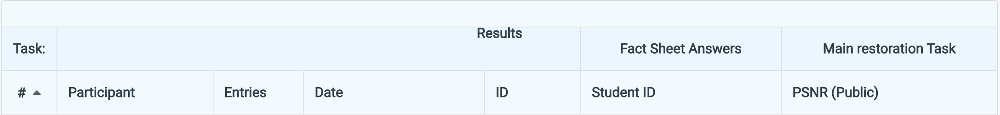

# HW4 Image Restoration

StudentID: 111550020  
Name: 方漢霖

## Task
- Inputs  
Degraded images (2 types: Rain and Snow)  
Training / Validation:  
1600 degraded images per type  
1600 corresponding clean images per type  
Test: 50 degraded images per type  
- Target  
Clean images corresponding to each degraded image
- Evaluation  
PSNR (Peak Signal-to-Noise Ratio)  
- Additional Requirements / Limitations  
    - No external data (i.e., data from other sources) allowed.  
    - Only pure vision-based model is allowed (No vision-language based model; No prompt-based model)
    - Base only on PrompIR to modify components/modules to improve the model performance.
    - Pretrained weights is prohibited.

## Prerequisites

### **Python Version**
- Python 3.8.20

### **Modules**
- See requirements.txt

## Installation

```bash
git clone https://github.com/NnAracy/Selected-Topics-in-Visual-Recognition-using-Deep-Learning

mv hw4_release_dataset Selected-Topics-in-Visual-Recognition-using-Deep-Learning/hw04

cd Selected-Topics-in-Visual-Recognition-using-Deep-Learning/hw04
```
- The dataset and sample code can be downloaded from [here](https://drive.google.com/drive/folders/1Q4qLPMCKdjn-iGgXV_8wujDmvDpSI1ul)

## Training
- Saves checkpoint every 10 epochs by default.

- Single gpu
```bash
python train.py --checkpoint_dir ./checkpoints --batch_size 2 --patch_size 128 --epochs 200
```
- Multiple gpus
```bash
python -m torch.distributed.launch --nproc_per_node={number_of_gpus} train.py --checkpoint_dir ./checkpoints --batch_size 2 --patch_size 128 --epochs 200
```

## Inference
```bash
python test.py --model_path checkpoints/best_model.pth --output_dir ./results/
```

## Performance Snapshot

